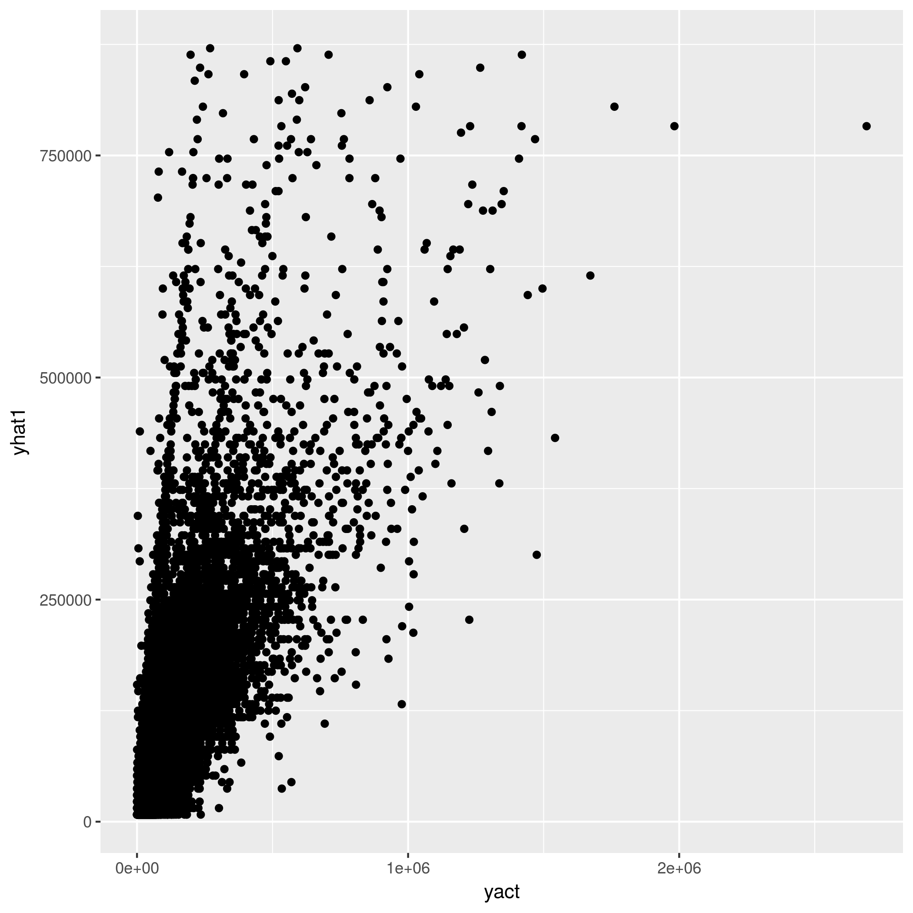

```{r setup, include=FALSE}
knitr::opts_chunk$set(echo = TRUE)
```

## Step 1 - Familiarize yourself with the data and the assignment

In this assignment you'll build some predictive regression models
with R on a dataset containing inpatient discharges from hospitals in New York.

The version of
this data that we'll be using is from a Kaggle dataset. See
https://www.kaggle.com/jonasalmeida/2015-deidentified-ny-inpatient-discharge-sparcs. 
Unfortunately, the column metadata wasn't posted. However, since this is a
publicly available dataset, we can visit the source at 
https://health.data.ny.gov/Health/Hospital-Inpatient-Discharges-SPARCS-De-Identified/82xm-y6g8.

If you scroll down on that page you'll find descriptions of the columns (click
the little Show All link to display the entire list).

Most of the fields are self-explanatory. You'll notice that there are several
sets of diagnosis and procedure codes. A few definitions are helpful.

### DRG - Diagnosis Related Groups

DRGs are a coding system developed in the 1980s that form the basis of how
hospitals are reimbursed from Medicare (US Govt) or private insurers. After
a patient is discharged from the hospital, a program known as a *DRG grouper*
uses information such as diagnosis and procedure codes (ICD-9-CM) to assign a DRG
to the patient. A full list of the over 900 DRGs can be found at:

https://www.cms.gov/Research-Statistics-Data-and-Systems/Statistics-Trends-and-Reports/MedicareFeeforSvcPartsAB/downloads/DRGdesc08.pdf

In that list you'll see that MDC (Medical Diagnostic Category) is simply a
grouping of DRGs.

### CCS - Clinical Classification System

The [CCS](https://www.hcup-us.ahrq.gov/toolssoftware/ccs/ccs.jsp) system was
developed by the [Agency for Healthcare Research and Quality
(AHRQ)](https://www.ahrq.gov/) to provide a classification system better suited
to healthcare research. There are CCS diagnosis codes and CCS procedure codes.
From their website:

> The Clinical Classifications Software (CCS) for ICD-9-CM is a diagnosis and
> procedure categorization scheme that can be employed in many types of projects
> analyzing data on diagnoses and procedures. CCS is based on the International
> Classification of Diseases, 9th Revision, Clinical Modification (ICD-9-CM), a
> uniform and standardized coding system. The ICD-9-CM's multitude of codes - over
> 14,000 diagnosis codes and 3,900 procedure codes - are collapsed into a smaller
> number of clinically meaningful categories that are sometimes more useful for
> presenting descriptive statistics than are individual ICD-9-CM codes.


As we did in class, you'll be creating an R Markdown document to
do the analysis as well as to document the
steps you did (and answer some questions I'll throw at you).

You'll notice a few "Hacker Extra" tasks thrown in. These are for those of you
who want to go a little above and beyond and attempt some more challenging
tasks.

## Step 2 - Create a new R Markdown document

Save this file as a new R Markdown document and name it something that
includes your last name in the filename. Save it into the
same folder as this file.

## Step 3 - Create project and load data

Create an R Studio project in the current folder (the one containing this file). You'll notice that there is a folder named **data**.
Inside of it you'll find the data file for this assignment:

- **ipd_resp.RData**

The full dataset contains over two million records and is available as a CSV
file from Kaggle. I did a little data filtering and cleaning to create a 
subset to use for this regression assignment. Specifically, I did the following:

- used dplyr to filter records so that we were just working with `APR MDC Code` == 4. These are patients having respiratory related diagnoses.
- a bunch of fields were read in as `chr` and I changed them to factors using `as.factor`. 
- There were some fields we don't need and they were dropped.
- Just as in HW1, I cleaned up the charges and costs fields that
got interpreted as `chr` because of the leading dollar sign. Now they are 
numeric.
- Modified some field names to make them easier to work with. 

See the data prep script for all the details. You do **NOT** need to run the
data prep script. I'm just including it so you can see a typical data prep
script.

### Load the data

```{r explore_str}
load("./data/ipd_resp.RData")
#str(ipd_resp)
```
## Step 4 - Partition into training and test sets

Just run this chunk to create training and test datasets. This way we'll
all be working with the same datasets. Notice that the test set is 30% of
the full dataset.

```{r partition}
set.seed(1828)
sample_size <- ceiling(0.30 * nrow(ipd_resp))
testrecs <- sample(nrow(ipd_resp),sample_size)
ipd_test <- ipd_resp[testrecs,]
ipd_train <- ipd_resp[-testrecs,]  # Negative in front of vector means "not in"
rm(ipd_resp) # No sense keeping a copy of the entire dataset around
```

## Step 5 - EDA on training data

Now start with some EDA on the training dataset`ipd_train`. The test data will only get
used after building models and want to compare their predictive abilities.

As mentioned above, the dependent variable that we are trying to predict is
`Total_Charges` - this is the amount that the hospital submits to whomever is
paying the bill for the hospital stay. This is usually an insurance company,
the federal Medicare or Medicaid program, an employer who self-insurers or
the patient. The `Payment_Typology_1` field contains the primary payer to whom
the charges are submitted. If you look at the relationship between `Total_Costs`
and `Total_Charges`, you'll start to see why the economics of the
US healthcare system is hard to understand.


You'll notice that `ipd_train` contains a few numeric fields and many
factors (categorical data). You are free to use any of these fields in your
regression models to predict `Total_Charges`.

Start by using things like ggplot2 and dplyr to explore the training dataset.
You can use other packages as well. Your goal is to gain a general understanding
of the variables and perhaps uncover some useful relationships that you can
use in your regression models.

**NOTE: In the data prep phase I made sure there were no NA values in the data
frames that we are using for this assignment. So, no need to worry about that.**

```{r}
library(dplyr)
library(ggplot2)
```

```{r}
summary(ipd_train)
```
Now, it's your turn ...

```{r}
head(ipd_train)
```

```{r}
str(ipd_train)
```

```{r}
ggplot(ipd_train) + geom_histogram(aes(x=Total_Charges), bins = 75) + facet_wrap(~Health_Service_Area, scales = "free_y") + xlim(0, 200000)+ theme(axis.text.x = element_text(angle = 60, hjust = 1)) + ggtitle("Total charges faceted by health service area")

ggplot(ipd_train) + geom_histogram(aes(x=Total_Charges), bins = 75) + facet_wrap(~Gender, scales = "free_y") + xlim(0, 200000)+ theme(axis.text.x = element_text(angle = 60, hjust = 1)) + ggtitle("Total charges faceted by gender")

ggplot(ipd_train) + geom_histogram(aes(x=Total_Charges), bins = 75) + facet_wrap(~Ethnicity, scales = "free_y") + xlim(0, 200000)+ theme(axis.text.x = element_text(angle = 60, hjust = 1)) + ggtitle("Total charges faceted by Ethnicity")

ggplot(ipd_train) + geom_histogram(aes(x=Total_Charges), bins = 75) + facet_wrap(~Age_Group, scales = "free_y") + xlim(0, 200000)+ theme(axis.text.x = element_text(angle = 60, hjust = 1)) + ggtitle("Total charges faceted by age group")

ggplot(ipd_train) + geom_histogram(aes(x=Total_Charges), bins = 75) + facet_wrap(~Type_of_Admission, scales = "free_y") + xlim(0, 200000)+ theme(axis.text.x = element_text(angle = 60, hjust = 1)) + ggtitle("Total charges faceted by Type of admission")

ggplot(ipd_train) + geom_histogram(aes(x=Total_Charges), bins = 75) + facet_wrap(~APR_Risk_of_Mortality, scales = "free_y") + xlim(0, 200000)+ theme(axis.text.x = element_text(angle = 60, hjust = 1)) + ggtitle("Total charges faceted by APR risk of mortality")

ggplot(ipd_train) + geom_histogram(aes(x=Total_Charges), bins = 75) + facet_wrap(~APR_Severity_of_Illness_Desc, scales = "free_y") + xlim(0, 200000)+ theme(axis.text.x = element_text(angle = 60, hjust = 1)) + ggtitle("Total charges faceted by APR severity of Illness")

ggplot(ipd_train) + geom_histogram(aes(x=Total_Charges), bins = 75) + facet_wrap(~Payment_Typology_1, scales = "free_y") + xlim(0, 200000)+ theme(axis.text.x = element_text(angle = 60, hjust = 1)) + ggtitle("Total charges faceted by payment typology")
```

```{r}
ggplot(ipd_train) + geom_point(aes(x=Length_of_Stay, y=Total_Charges))
ggplot(ipd_train) + geom_point(aes(x=Total_Costs, y=Total_Charges)) + ylim(0, 500000)
```
 


```{r}
ggplot(ipd_test) + geom_histogram(aes(x=Total_Charges), bins=50)
```


## Step 6 - Building and evaluation of predictive models

Now that you know a little more about the data, it's time to start building a
few predictive models for `Total_Charges`. The error metric that we will use
to evaluate the models (both for fit and for predictions) is 
**median absolute deviation** (MAD). This is nothing more than the median
of the absolute value of the residuals for a fitted model. 

**QUESTION:** What might be an advantage of using median absolute deviation instead
of mean absolute deviation?

Obviously we want models with lower MAD values. Our ultimate goal is to create
a model that predicts well on the test dataset, `ipd_test`.

### Null model

It's always a good idea to start out with what we call the *null model*. This
is the simplest possible model and one that other models better be able to 
beat. For this regression problem, the null model is simply a regression model
that just has a y-intercept. If you remember some of your statistics, you won't
be surprised that the best fit value for the y-intercept in this case is 
the mean of the response variable, `Total_Charges`.

```{r charges_null_model}
charges_lm0 <- lm(Total_Charges ~ 1, data = ipd_train)
summary(charges_lm0)
# Compute the MAD value
median(abs(charges_lm0$residuals))
```

It's not hard to create regression models with smaller MAD values than this. :)

Just to give you a benchmark, I built a model on the training set that had
a MAD value of 7270.340. Again, this is just the median of the absolute
values of the residuals of the fitted model. Later when I used this model on
the test data, I got a MAD of ... well, I'll tell you a little later.


### Model building

Using the information you've gained from reading about the data and doing some
EDA, build several regression models and compute the MAD from each. Summarize
your results in terms of which model or models appear to fit well. 

Identify your top 3 models in terms of lowest MAD values to use in the next part in which you'll use them
to make predictions on the test dataset.

**HACKER EXTRA:** Use k-crossfold validation to select your top 3 models.

### Model diagnostics

#### Scatterplots of actual vs fitted values

For your top 3 models, create a scatter plot showing actual vs fitted values
of `Total_Charges`. Remember, it's often nice to "gather up" your results
into a data frame to facilitate plotting. See the notes on comparing competing
regression models. Here's what one of my scatterplots looks like.



#### Normality of residuals

Create a histogram of the residuals for your top 3 models. You may have to
tweak the axes scales to make a nice histogram.

#### Constant variance

Make an appropriate plot to check for constant variance (homeskedasticity) for
your top model. 
Don't remember what kind of plot to make? See my notes on residual analysis
or any intro stats book.

### Make predictions for the test dataset

For each of your top 3 models, make predictions for `ipd_test`.

### Evaluate the predictions

Compute the MAD for each of the three models' predictions on the test data.

HINT: Obviously you can't use the residuals (or errors) directly but will have to compute
them. They are simply the difference between the actual values and your predicted values.

So, for the model I mentioned earlier that had a MAD of 7270.340 for the training
data, the MAD on the test data was 7335.559. Notice that MAD for test is 
higher than MAD for train.

**QUESTION:** Do you think it's typical that MAD for test would be higher than
MAD for train? Why or why not?

**QUESTION:** Which of your top 3 models had the lowest MAD for the test data? 

**QUESTION:** How do the MAD values for the test data compare to the MAD values
for the training data?

Finally, create some sort of plot which shows the MAD values for both 
train and test for your top 3 models. One plot.

### Your top model

Show your top performing model and discuss whether the model appears to make
sense in terms of the variables included. Why did you choose the variables you
did?

It will be interesting to compare the best models that everyone finds.

Later we'll learn more techniques that will likely allow us to beat simple
linear models.

